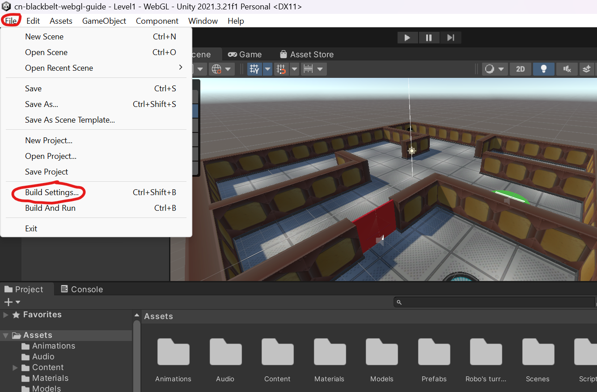
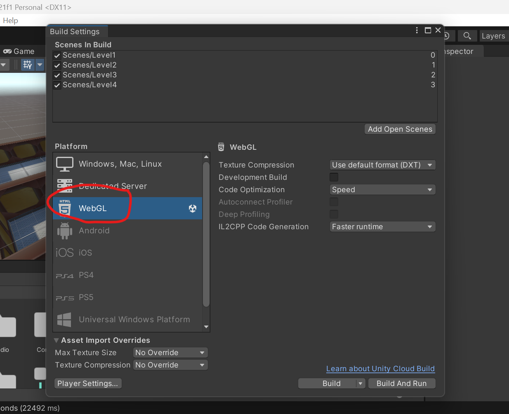
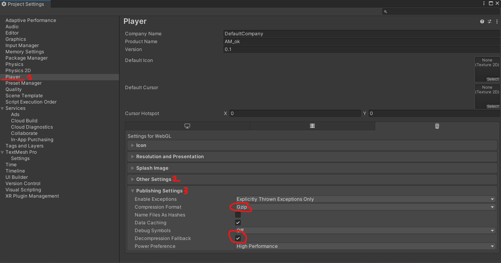
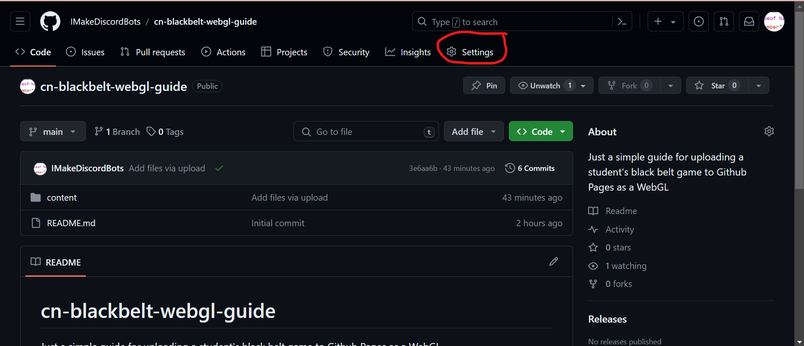
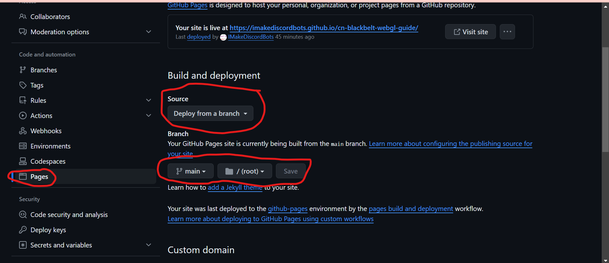
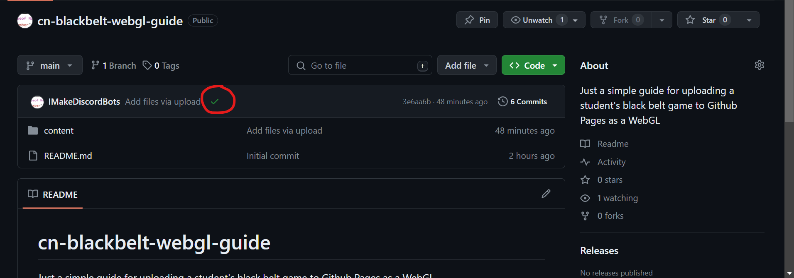

# cn-blackbelt-webgl-guide
Just a simple guide for uploading a student's black belt game to GitHub Pages as a WebGL 

1. Create and open a new project in Unity.
2. After importing necessary assets and verifying the game works correctly, click on 'File' in the top left corner and navigate to 'Build Settings'. 
3. Once you are in 'Build Settings', select WebGL in the list of options. If it says you have to install the WebGL tools, click the 'Install with Unity Hub' button(it should say something along those lines). 
4. Once WebGL has been installed(or if it already has been installed), click the 'Player Settings" button in the bottom left of the 'Build Settings' window. 
5. Within the new 'Player Settings' window, ***1)*** Select 'Player' from the list on the left side of the window, then ***2)*** select 'Other Settings' and fix any errors it says there are-they have pretty straightforward explanations for making sure you can fix them easily, and ***3)*** select 'Publishing Settings' and make sure 'Decompression Fallback' is checked and 'Compression Format' is gzip. ***It is important you do all these things(ESPECIALLY THE STUFF FOR COMPRESSION) so that the game actually works once you've published it to GitHub.*** 
6. Close the 'Player Settings' window once this is done, and now click 'Build' in the 'Build Settings' window. ***DO NOT CLICK 'BUILD AND RUN'***
7. After the game has finished building, Unity should prompt you to save this new built game to a folder. I recommend you right click in the explorer pop-up that has your game files and make a new folder there so it's easy to find later on.
8. Once you have done that and Unity has saved your game build files to the folder you made, make a new repository on GitHub and then upload just that folder to GitHub. Commit these new files too. Once GitHub has finished uploading and committing your files, click on the settings tab on the page for your repo. 
9. In the settings page, click on the 'Pages' tab on the list on the left side of the screen. In this 'Pages' tab, make sure your settings look like those in the image. 
10. Once that's done, give GitHub some time to build the page. It should tell you when it's done and you should see either an orange circle(it's still building) or a green checkmark(it has built successfully and has deployed) in this area on the code tab of your repo. 
11. Once your game has been built, navigate to it's page in a new chrome tab. The link to the game should be 'https://[your-github-username].github.io/[name-of-your-repository]/[name-of-the-folder-you-uploaded-that-has-index.html-in-it]/index.html'.

